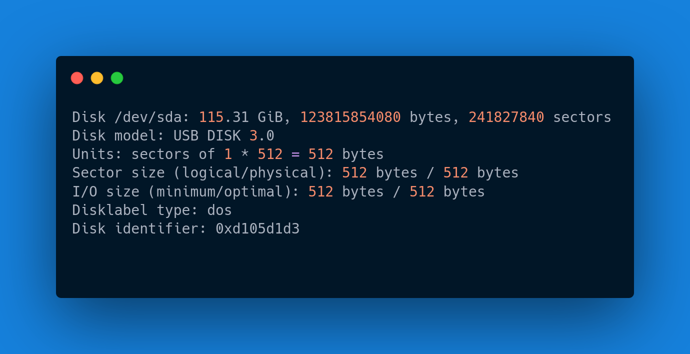

<div align="center">
<h1>Encrypting Device Using LUKS</h1>
</div>

At the end of this guide you will have a device encrypted using LUKS.

Which commands are we going to use for this guide?  

**cryptsetup**, **fdisk**, **mkfs**  

## Step 1  

Plug your device

```bash
sudo fdisk -l
```

The command above will show you a list of the devices connected into your computer.  




## Step 2  

In my case the device is located in /dev/sda so I'm going to choose:

```bash
sudo fdisk /dev/sda
```

Select the next options in the following order.

1. **d** = For delete partition  
1. **n** = New partition  
1. **Enter** = Primary default  
1. **Enter** = Partition number default 1  
1. **Enter** = First sector default  
1. **Enter** = Last sector default  
1. **Y** = Do you want to remove the signature  
1. **w** = Write  

## Step 3  

Add luksFormat to partition and create password

```bash
sudo cryptsetup luksFormat /dev/sda1
```
A warning will be display type **YES** and then you will be ask to add a password for your encrypted partition.

## Step 4  

Open luks partition with a name "I choose backup but you can choose anyother name like Drive, USB it doesn't matter".


```bash
sudo cryptsetup open /dev/sda1 backup
```

## Step 5  

Make filesystem for the luks partition.

For this example I will use ext4 but you can choose any other format.  

```bash
sudo mkfs.ext4 /dev/mapper/hamburger
```

## Step 6  

Mount the Partition

```bash
sudo mount /dev/mapper/hamburger /mnt
```

##  Step 7  

Unmount and close partition

```bash
sudo umount /mnt
sudo cryptsetup close hamburger
```

